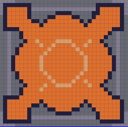
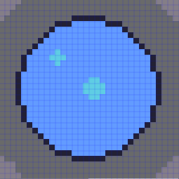
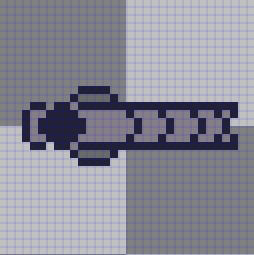

![[chrome_MIKyMTOb0w.png]]
Galactic Defense는 외계 군대의 공격으로부터 함선을 방어하는 게임입니다. 플레이어는 매 웨이브마다 몰려오는 적 분대에 맞서 함선을 확장하고 쉴드를 전개하며 생존해야 합니다.

- 화면의 우측 하단에서 현재 웨이브와 보유 코인 정보를 확인할 수 있습니다.
- 붉은 반원은 에너지 게이지입니다. 에너지 게이지 주변을 드래그함으로 에너지 실드를 활성화하여 함선을 방어할 수 있습니다.
- 현재 함선과 인접한 빈칸을 클릭해 함선을 확장할 수 있습니다.
![[Pasted image 20260706121655.png]]

- 함선의 특정 칸을 선택하여 업그레이드하거나 삭제할 수 있습니다.
    -  에너지 블록은 에너지를 생산하며, 저장 가능한 에너지 총량을 늘려줍니다. 에너지 실드를 사용하기 위해 필요합니다.
    -  코어 블록은 코인을 생산하며, 함선의 심장과도 같은 블록입니다. 함선의 모든 코어 블록이 파괴되면 게임 오버됩니다.
    -  터렛 블록은 가까운 적을 공격합니다.
![[Pasted image 20260706121827.png]]

- 공격 전 노란색으로 점멸하는 적의 경우, 함선을 관통하는 공격을 합니다. 에너지 실드를 통해 방어하세요.
![[Pasted image 20260706121328.png]]

- 공격 전 빨간색으로 점멸하는 적의 경우, 매우 치명적인 관통 공격을 합니다. 반드시 에너지 실드로 방어해야 합니다.
![[Pasted image 20260706121525.png]]
## 제작과정
### 기획 및 개발 배경
개인 일정으로 실제 개발에 할당할 수 있는 기간이 짧았습니다. 이 기간을 최대한 활용하고자 개발하지 못한 기간 동안 기획과 개발 계획 수립에 집중했습니다.
디펜스 게임 중 가장 먼저 떠오르고 많이 플레이한 장르는 타워 디펜스였지만, 타워 디펜스는 기존 게임들로부터의 차별성을 찾아 나만의 디펜스 게임을 만들기 어렵다고 판단했습니다. 이에 플레이어의 능동적인 플레이를 유도할 수 있는 "에너지 실드" 기믹을 메인 시스템으로 채택했습니다. 여기에 플레이어가 자신의 함선을 직접 확장하고 커스텀할 수 있는 빌딩 요소를 결합하여, 타워 디펜스처럼 직접 제작하고 방어한다는 몰입감을 강화했습니다.
### 핵심 시스템 설계 및 구현
- 무한 웨이브 시스템: 제한된 개발 기간 대비 플레이 타임을 극대화하기 위해 무한 웨이브 시스템을 도입했습니다. 계산식에 따라 각 웨이브의 총 코스트가 산정되며, 해당 코스트 내에서 적 유닛이 무작위로 편성되도록 설계했습니다.
- 핵심 게임 플레이: 고정된 우주선을 확장해 나가는 방식을 통해 건설형 디펜스 본연의 재미를 유지했습니다. 동시에 플레이어가 직접 방어막을 그리는 매커니즘을 통해 능동적인 조작감을 부여했습니다.
### 리소스 및 개발 프로세스
- 프로그래밍: 전반적인 구조와 로직 기획은 직접 수행하였으며, 실제 코드 구현은 Github Copilot Codex, Antigravity Gemini에게 맡겨 생산성을 높였습니다. 다양한 파라미터를 Unity 에디터 상에서 수정할 수 있도록 설계하여 직접 테스트하며 밸런스를 조정했습니다.
- 리소스: 스프라이트 및 효과음은 기본적으로 에셋을 활용하였으며, 적합한 리소스가 없는 경우 AI를 활용하여 직접 제작하였습니다. 배경음악은 Suno AI를 활용해 제작했습니다.

[플레이하기](https://drive.google.com/file/d/1RgGzW4xOrv-TJcoaeQhxXAyROy19B7qL/view?usp=sharing)
